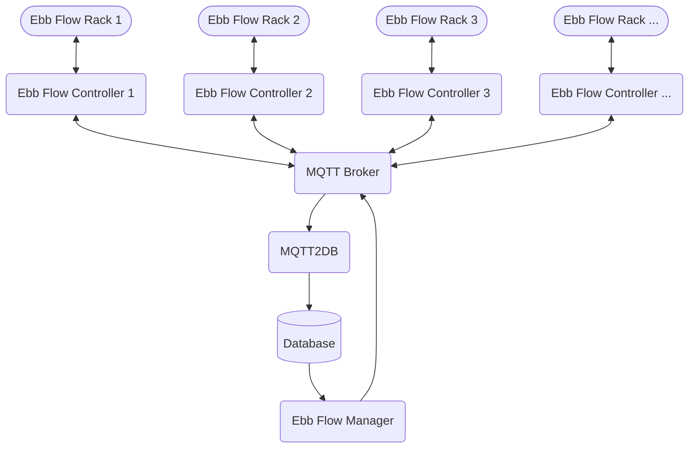

[](https://github.com/phofmeier/EbbFlowManager/actions/workflows/release.yml)
[](https://github.com/phofmeier/EbbFlowManager/actions/workflows/pre-commit.yml)
[](https://github.com/phofmeier/EbbFlowManager/actions/workflows/unit-tests.yml)

# EbbFlowManager

Web application to show the status and manage the configuration of multiple [Ebb Flow Controller](https://github.com/phofmeier/EbbFlowControl). For an automated Ebb Flow Hydroponic ecosystem.

## System Overview

The System consists of 5 Components

- [Ebb Flow Manager](https://github.com/phofmeier/EbbFlowManager)
- [Ebb Flow Controller](https://github.com/phofmeier/EbbFlowControl)
- MQTT Broker
- [MQTT2DB](https://github.com/phofmeier/mqtt2db)
- Mongo DB Database

Each [Ebb Flow Controller](https://github.com/phofmeier/EbbFlowControl) is connected to one hardware rack and controls it independently. For configuration, status and data logging the [Ebb Flow Controller](https://github.com/phofmeier/EbbFlowControl) has a MQTT connection. All the data from the [Ebb Flow Controller](https://github.com/phofmeier/EbbFlowControl) is written with the [MQTT2DB](https://github.com/phofmeier/mqtt2db) application to a Mongo DB database. The [Ebb Flow Manager](https://github.com/phofmeier/EbbFlowManager) reads the data from this Database to show the data of the Controller and can send new configurations to the Controller by publishing MQTT Messages.



## Usage

See the [example](example/README.md) on how to run all the needed components to use the Ebb Flow Manager.

For more in detail explanation of the configuration see the documentation of the [Ebb Flow Controller](https://github.com/phofmeier/EbbFlowControl)

## Deployment

### Local installation

Install and run the application locally using pip.

```sh
python3.13 -m venv ./venv/
source venv/bin/activate
pip install . # or use pip install -e .[dev] for development
ebb_flow_manager
```

For development run

```sh
panel serve src/ebb_flow_manager/ebb_flow_manager_app.py --dev
```

### Docker

Checkout the example for using this app with docker compose [here](example/README.md).

Or only run the app in a container with the following command.

```sh
docker run -d -v ./config.yml:/home/app/config.yml ghcr.io/phofmeier/ebbflowmanager:latest
```
